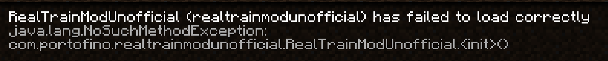

# RealTrainModUnofficial (RTMU) Forge 1.20.1 Port

このmodはRealTrainModの非公式1.21.1移植版である[RealTrainModUnofficial](https://github.com/325-Sunnygo/RealTrainModUnofficial)を1.20.1 Forgeに移植したmodです。

## 状態



## 動作環境

- Minecraft **1.20.1**
- **Forge** 47.4.21
- **Java 17**

## ビルド

```bash
./gradlew build
```

生成された jar は `build/libs/` に出力されます。

## クレジット/Special thanks

- [RealTrainMod](https://www.curseforge.com/minecraft/mc-mods/realtrainmod) / [NGTLib](https://www.curseforge.com/minecraft/mc-mods/ngtlib) — [ngt5479](https://www.curseforge.com/members/ngt5479/projects)
- [KaizPatchX](https://github.com/Kai-Z-JP/KaizPatchX) — (c) Kaiz_JP and other authors 2021
- [RealTrainModUnofficial](https://github.com/325-Sunnygo/RealTrainModUnofficial) — [325-Sunnygo](https://github.com/325-Sunnygo)